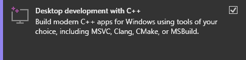

# Microsoft Windows

## Requirements

* [Bison v3.8.2](https://www.gnu.org/software/bison/)
* [CMake v3.24.1](https://cmake.org/)
* [Flex v2.6.4](https://github.com/westes/flex)
* [Microsoft Visual Studio 2022](https://visualstudio.microsoft.com/vs/community/)

## Install

Its recommended to install _Microsoft Visual Studio 2022_ first, and then _CMake_, not the other way. In the IDE installer, choose:



If you need executables for _Flex_ and _Bison_, download both from [Google Drive](https://drive.google.com/file/d/1v0uCtezXvJRt_MxE9eZafRIdkJOQng4u/view?usp=sharing). After decompression, add the absolute path of the folder to the `PATH` environment variable. Then, open a command prompt and type this to test the installation:

```powershell
bison --version
flex --version
```

## Build

```powershell
script\windows\build.bat
```

## Test

```powershell
script\windows\test.bat
```

## Start

```powershell
script\windows\start.bat <program>
```

Replace `<program>` with a path to the program file.
